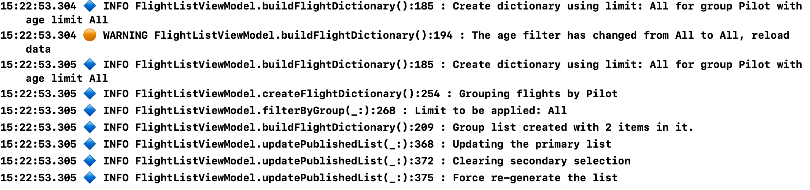

# UtilityClasses
Shared helper classes

## WriteLog

I have used SwiftyBeaver for logging in previous apps. It has the downside of adding
a third party dependency to my code and introduces an overhead that I don't need for
development. Remember, this isn't supposed to be an app log for use on released code,
just a lightweight way to log actions during development. SwiftyBeaver was total
over-kill for this but was also a great tool. 

WriteLog is my lightweight alternative that gives me just enough logging to be
useful without the overheads of a web logging system.

